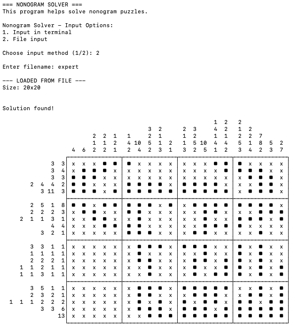

# Nonogram Solver

This program solves nonogram puzzles (also known as picross or griddlers) using logical deduction and backtracking algorithms. It works with puzzles of sizes 10x10, 15x15, and 20x20.

## Example on use
